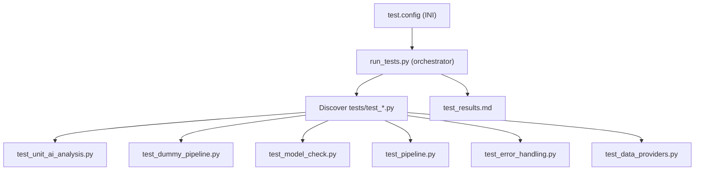

# Enhanced Test Suite for NewsTrader Pipeline

## Architecture




## 1. Create `Scripts/test.config` (INI format)

All test behavior is driven by this config file. The orchestrator and sub-tests read it via Python's built-in `configparser`.

```ini
[general]
# Stop after first failure (can also be set via --stop-on-failure CLI flag)
stop_on_failure = false
# Timeout in seconds for each pipeline subprocess
timeout = 300

[tests]
# Enable/disable individual test modules (true/false)
#
# unit_ai_analysis: Unit tests for ai_analysis.py pure functions (regex,
#   parsing, validation, key normalization). No LLM or network needed.
unit_ai_analysis = true
#
# dummy_pipeline: Runs pipeline with --quick-analysis --dummy-analysis.
#   No LLM calls. Validates Excel structure, row counts, PDF/log output.
dummy_pipeline = true
#
# model_check: Runs --model-check per enabled provider ([providers]) and
#   each model in [models] to verify LLM connectivity. Skips if API key missing.
model_check = true
#
# pipeline: Runs the full analysis pipeline for each combination from
#   [providers], [models], [multistep]. Validates LLM produces parseable
#   results with correct structure. Most expensive test -- the only one
#   that verifies end-to-end LLM analysis. Disable for fast iteration, then
#   only tests unit_ai_analysis, model_check, error_handling etc. are executed.
pipeline = true
#
# error_handling: Sends invalid inputs (bad provider, missing env) and
#   verifies the pipeline fails gracefully with non-zero exit codes.
error_handling = true
#
# data_providers: Network smoke tests for forex rates, Google News RSS,
#   Tiingo API. Calls functions directly (not via pipeline). Skipped
#   when keys or network are unavailable.
data_providers = true

[providers]
# Which providers to include in pipeline and model-check tests
ollama = true
anthropic = true
openai = true

[models]
# Comma-separated models to test per provider
ollama = tinyllama:latest, llama3.2:1b, mistral:latest
anthropic = claude-3-5-haiku-latest
openai = gpt-4o-mini

[multistep]
# Whether to vary multistep on/off in pipeline tests
vary = true
# Threshold values to test (comma-separated)
thresholds = 4096, 8192
```

### Config options reference

**[general]**

- `stop_on_failure` -- if true, abort after the first FAIL (default: false; CLI `--stop-on-failure` overrides to true)
- `timeout` -- max seconds per pipeline subprocess (default: 300)

**[tests]**

- `unit_ai_analysis` -- pure-function unit tests for ai_analysis.py (default: true)
- `dummy_pipeline` -- end-to-end run with --dummy-analysis, no LLM needed (default: true)
- `model_check` -- run --model-check per enabled provider and each of its models from [models] (default: true)
- `pipeline` -- full provider/model/multistep matrix with deep validation (default: true)
- `error_handling` -- invalid inputs and error-path tests (default: true)
- `data_providers` -- optional network smoke tests for forex, news, Tiingo (default: true)

**[providers]**

- `ollama` -- include ollama in pipeline and model-check tests (default: true)
- `anthropic` -- include anthropic (skipped at runtime if API key missing) (default: true)
- `openai` -- include openai (skipped at runtime if API key missing) (default: true)

**[models]**

- `ollama` -- comma-separated list of ollama models to test (default: tinyllama:latest, llama3.2:1b, mistral:latest)
- `anthropic` -- comma-separated list of anthropic models (default: claude-3-5-haiku-latest)
- `openai` -- comma-separated list of openai models (default: gpt-4o-mini)

**[multistep]**

- `vary` -- whether to test both multistep=on and multistep=off (default: true; if false, only tests multistep=on)
- `thresholds` -- comma-separated threshold values to test when multistep=on (default: 4096, 8192)

### CLI flags for run_tests.py

- `--dry-run` -- print what would run without executing
- `--stop-on-failure` -- override config to stop on first failure
- `--free-models` -- override config: set providers to ollama-only
- `--run=<spec>` -- run only the specified test(s), **bypassing test.config entirely**. The config file is not loaded or used. Accepts a comma-separated list of fully specified test invocations using `/` (slash) notation. No defaults are applied -- all required parameters must be provided. Slash is used instead of dot because model names can contain dots (e.g., `llama3.2:1b`).

`**--run` format:** `module[/param1/param2...]`

Modules and their required parameters:

- `unit_ai_analysis` -- no parameters (pure function tests)
- `dummy_pipeline` -- no parameters (always runs --quick-analysis --dummy-analysis)
- `model_check/PROVIDER/MODEL` -- requires provider and model, e.g., `model_check/ollama/mistral:latest`
- `pipeline/PROVIDER/MODEL/MULTISTEP[/THRESHOLD]` -- requires provider, model, and multistep (on/off). Threshold is required when multistep=on, omitted when multistep=off. e.g., `pipeline/ollama/mistral:latest/on/4096` or `pipeline/ollama/mistral:latest/off`
- `error_handling` -- no parameters (fixed set of error cases)
- `data_providers` -- no parameters (runs all available smoke tests)

Incomplete parameter specs are rejected with an error message showing the expected format.

`**--run` examples:**

```bash
# Run only the unit tests module
python run_tests.py --run=unit_ai_analysis

# Run only model_check and dummy_pipeline
python run_tests.py --run=model_check/ollama/mistral:latest,dummy_pipeline

# Run a single pipeline test with multistep on
python run_tests.py --run=pipeline/ollama/mistral:latest/on/4096

# Run a single pipeline test with multistep off (no threshold needed)
python run_tests.py --run=pipeline/anthropic/claude-3-5-haiku-latest/off

# Run two specific pipeline tests
python run_tests.py --run=pipeline/ollama/mistral:latest/on/4096,pipeline/ollama/tinyllama:latest/off

# Mix: unit tests + one specific pipeline test
python run_tests.py --run=unit_ai_analysis,pipeline/ollama/mistral:latest/on/4096

# Model name with dot is unambiguous thanks to slash separator
python run_tests.py --run=pipeline/ollama/llama3.2:1b/on/4096
```

## 2. Restructure [run_tests.py](NewsTrader/Scripts/run_tests.py)

Rewrite as a **test orchestrator** that:

- If `--run=<spec>` provided: **skip loading test.config entirely**. Parse the spec, select only the named module(s), pass all parameters via `--filter=` arg to the sub-test. No config file is loaded and no defaults are applied.
- Otherwise: load `Scripts/test.config` via `configparser` (with sensible defaults if file missing), discover `tests/test_*.py` files, filter by `[tests]` enable/disable settings
- Runs each selected test via subprocess, passing `--config=path` when config-driven (or `--filter=params` when using `--run`)
- Parses structured output from each sub-test (lines matching `PASS: <name> | <msg>`, `FAIL: <name> | <msg>`, or `SKIP: <name> | <reason>`)
- Collects results and writes `**test_results.md**` in the `Scripts/` directory -- markdown with summary table at top, detailed results below
- `--stop-on-failure` (CLI or config): stops executing further tests after the first FAIL
- `--free-models`: overrides `[providers]` to ollama=true, anthropic=false, openai=false
- Exit code: 0 if all pass, 1 if any fail

### test_results.md format

Markdown file with a quick summary table at the top, followed by detailed results per module.

```markdown
# Test Results - 2026-02-06 14:30:00

## Summary

| Test | Result |
|------|--------|
| unit_ai_analysis | OK |
| dummy_pipeline | OK |
| model_check | OK |
| pipeline | FAILED |
| error_handling | OK |
| data_providers | SKIPPED |

**Total: 42 passed, 1 failed, 0 skipped**

## Details

### unit_ai_analysis
- PASS: validate_complete_valid_result | OK
- PASS: validate_missing_recommendation | OK
- PASS: regex_extract_buy_sentence | OK

### pipeline
- PASS: ollama/mistral:latest/on/4096 pipeline_exits_zero | OK
- PASS: ollama/mistral:latest/on/4096 valid_recommendations | OK
- FAIL: ollama/tinyllama:latest/off no_parse_failures | Asset X: [parse failed]

### data_providers
- SKIP: tiingo_news_returns_list | TIINGO_API_KEY not set
```

## 3. Create `Scripts/tests/__init__.py`

Empty file to make the folder a package (not strictly needed for subprocess execution, but good practice).

## 4. Create `Scripts/tests/test_helpers.py`

Shared utilities for all sub-tests:

- `**report(name, passed, msg)**` -- prints `PASS: name | msg` or `FAIL: name | msg` to stdout
- `**skip(name, reason)**` -- prints `SKIP: name | reason`
- `**get_daily_folder()**` -- returns today's `Analysen/{yymmdd}/` path
- `**get_debug_excel_path()**` -- returns path to today's `_DEBUG.xlsx`
- `**read_excel_sheet(path, sheet)**` -- thin wrapper around pd.read_excel
- `**count_input_assets()**` -- reads `Open_Positions_Debug.xlsx` and `Watch_Positions_Debug.xlsx`, returns (n_portfolio, n_watchlist)
- `**find_column(df, keyword)**` -- case-insensitive column lookup (replaces duplicate logic in current code)
- `**load_test_config(config_path)**` -- reads test.config via configparser, returns the config object; sub-tests receive the path via `--config=` arg

## 5. Sub-test scripts

### 5a. `Scripts/tests/test_unit_ai_analysis.py`

**No pipeline run needed.** Imports functions directly from `ai_analysis.py` and tests:

- `**_normalize_analysis_keys**`: German-key dict maps correctly to English
- `**_validate_analysis_result**`: (a) complete valid dict returns `(True, [])`, (b) missing Recommendation returns it in missing list, (c) wrong type for recommended_quantity detected, (d) invalid Confidence value detected
- `**_build_failure_result**`: returns all required keys, `_parse_failed` is True, Recommendation is `[Parse failed]`
- `**_lenient_parse**`: (a) complete valid dict passes through, (b) missing fields get `[Missing]` placeholders and `_parse_failed` flag, (c) invalid Recommendation gets `[Invalid]`, (d) non-int quantity coerced to 0, (e) optional fields (target_price, stop_loss) coerced to float or None
- `**_regex_extract**`: (a) `"I recommend Buy 10 shares because of news"` extracts Recommendation=Buy, recommended_quantity=10, (b) empty string returns None, (c) `"Hold confidence: Medium"` extracts both fields, (d) text with no recognizable fields returns None

### 5b. `Scripts/tests/test_dummy_pipeline.py`

Runs `AnalyzePortfolio_Pipeline.py --quick-analysis --dummy-analysis` once, then validates all outputs:

- **pipeline_exits_zero**: returncode == 0
- **excel_exists**: `_DEBUG.xlsx` file created
- **excel_has_portfolio_sheet**: sheet "Portfolio Analyse" readable, has Recommendation column
- **excel_has_watchlist_sheet**: sheet "Watchlist Analyse" exists and is readable (if `Watch_Positions_Debug.xlsx` exists)
- **excel_row_count_matches_input**: row count on sheet "Portfolio Analyse" matches number of assets in `Open_Positions_Debug.xlsx`
- **all_recommendations_hold**: every Recommendation == "Hold" (dummy mode always returns Hold)
- **all_confidence_low**: every Confidence == "Low" (dummy mode always returns Low)
- **pdf_files_exist**: at least one `{date}_*_DEBUG.pdf` file exists in the daily folder
- **log_file_exists**: `{date}_Pipeline.log` exists
- **log_no_fatal**: log file does not contain "FATAL" (uppercase)

### 5c. `Scripts/tests/test_model_check.py`

Reads `[providers]` and `[models]` from config. For each enabled provider and each model listed for that provider, runs `AnalyzePortfolio_Pipeline.py --quick-analysis --model-check --provider=X --mode=Y`:

- **PROVIDER/MODEL_model_check**: exits 0 (e.g., `ollama/mistral:latest`, `ollama/tinyllama:latest`, `ollama/llama3.2:1b`, `anthropic/claude-3-5-haiku-latest`, `openai/gpt-4o-mini`)
- Skipped if provider=false in config, or API key missing for anthropic/openai
- Note: `--quick-analysis` is included for consistency even though `--model-check` exits before the main pipeline

### 5d. `Scripts/tests/test_pipeline.py`

Reads `[providers]`, `[models]`, `[multistep]`, and `[general].timeout` from config to build the test matrix. For each provider/model/multistep combination:

- **pipeline_exits_zero**: returncode == 0
- **excel_exists**: output file created
- **no_parse_failures**: no `[Parse failed]`, `[Missing]`, `[Invalid]` in Recommendation column (existing check)
- **valid_recommendations**: every Recommendation is one of Buy/Sell/Hold/Add/Reduce
- **valid_confidence**: every Confidence is High/Medium/Low
- **quantity_is_int**: recommended_quantity column is integer-typed
- **reasoning_not_empty**: Reasoning column has no empty/null values
- **watchlist_sheet_exists**: sheet "Watchlist Analyse" is readable
- **pdf_files_exist**: at least one PDF in daily folder
- **log_no_fatal**: log file has no FATAL lines
- **duration_logged**: elapsed seconds printed for each pipeline run (informational, not a pass/fail)

### 5e. `Scripts/tests/test_error_handling.py`

Tests that bad inputs produce non-zero exit and don't crash ungracefully:

- **invalid_provider**: `--quick-analysis --provider=nonexistent` exits non-zero
- **model_check_bad_provider**: `--model-check --provider=nonexistent` exits non-zero
- **missing_env_file**: temporarily rename `env.txt`, run `--quick-analysis --model-check`, confirm failure. **Must use try/finally** to guarantee `env.txt` is restored even if the test crashes

### 5f. `Scripts/tests/test_data_providers.py`

Optional smoke tests (skipped if keys/network unavailable). Imports functions directly:

- **forex_rate_returns_float**: `get_forex_rate("EUR", "USD")` returns a float > 0
- **google_news_returns_list**: `get_google_news("Apple")` returns a list (may be empty, but no exception)
- **tiingo_news_returns_list**: `tiingo_get_news(tickers="AAPL", limit=3)` returns a list (skip if TIINGO_API_KEY not set)

Async functions (`get_forex_rate`, `get_google_news`) are called via `asyncio.run()`. `tiingo_get_news` is synchronous and called directly.

## 6. Key implementation details

### All invocations use --quick-analysis

Every sub-test that invokes `AnalyzePortfolio_Pipeline.py` must always include `--quick-analysis`, even for `--model-check` (where it has no effect but ensures consistency). This guarantees only the small debug input files (`Open_Positions_Debug.xlsx`, `Watch_Positions_Debug.xlsx`) are used, keeping tests fast and avoiding production data. Additional flags like `--dummy-analysis`, `--model-check`, or `--provider=X` are appended alongside it.

### Sub-test output protocol

Every sub-test script must:

- Print `PASS: <test_name> | <message>`, `FAIL: <test_name> | <message>`, or `SKIP: <test_name> | <reason>` to stdout
- Exit 0 if all tests pass or are skipped, exit 1 if any fail
- Accept `--config=<path>` to receive the config file path from the orchestrator
- Accept `--filter=<params>` to receive fully specified parameters from `--run` (slash-separated; e.g., `--filter=ollama/mistral:latest/on/4096` for pipeline). When received, run only that exact case. Modules with no parameters ignore this flag.
- Accept `--dry-run` (print what would run without executing)

### Orchestrator flow in run_tests.py

1. Parse CLI args (`--dry-run`, `--stop-on-failure`, `--free-models`, `--run=<spec>`)
2. If `--run=<spec>`:
  - **Do not load test.config** -- config file is completely bypassed
  - Parse comma-separated entries, extract module name and all slash-separated parameters
  - Validate that all required parameters for each module are present; reject incomplete specs with an error showing the expected format
  - Select only those modules; pass fully specified parameters via `--filter=` arg
3. Otherwise (config-driven mode):
  - Load `test.config` via configparser (use defaults if file missing)
  - If `--free-models`: override `[providers]` to ollama=true, anthropic=false, openai=false
  - If `--stop-on-failure`: override `[general].stop_on_failure` to true
  - Map `[tests]` section keys to filenames (`unit_ai_analysis` -> `tests/test_unit_ai_analysis.py`, `pipeline` -> `tests/test_pipeline.py`, etc.), filter to enabled, sort alphabetically
4. For each selected test file: run via subprocess with `--config=path` (config mode) or `--filter=params` (`--run` mode), capture stdout, parse PASS/FAIL/SKIP lines, record results
5. If `stop_on_failure` and a FAIL is found, stop running further test files (applies in both modes)
6. Write `test_results.md` in `Scripts/` with summary table + detailed results
7. Print summary and exit

### sys.path for imports

Sub-tests that import from `ai_analysis.py` or `data_providers.py` need `Scripts/` on `sys.path`. Each sub-test will insert `Path(__file__).resolve().parent.parent` (i.e., `Scripts/`) into `sys.path[0]` at the top.

### --help with examples

The argparse `epilog` (using `RawDescriptionHelpFormatter`) should include usage examples so that `python run_tests.py --help` shows them directly:

```
Examples:
  python run_tests.py                              Run all enabled tests from test.config
  python run_tests.py --dry-run                    Show what would run without executing
  python run_tests.py --free-models                Only test ollama provider
  python run_tests.py --stop-on-failure            Stop after first failure
  python run_tests.py --run=unit_ai_analysis       Run only unit tests (no config needed)
  python run_tests.py --run=dummy_pipeline,error_handling
                                                   Run two specific test modules
  python run_tests.py --run=model_check/ollama/mistral:latest
                                                   Check one specific model
  python run_tests.py --run=pipeline/ollama/mistral:latest/on/4096
                                                   Run one specific pipeline test
  python run_tests.py --run=pipeline/ollama/llama3.2:1b/off
                                                   Pipeline test with multistep off

Note: --run uses / (slash) as separator because model names may contain dots.
Configuration: test.config (see run_tests.md for details)
```

## 7. Create `Scripts/run_tests.md`

Documentation file covering the full test suite. Contents:

- **Overview**: What the test suite does, how it's structured (orchestrator + sub-tests)
- **Quick start**: How to run all tests, how to run a quick smoke test
- **CLI reference**: All flags (`--dry-run`, `--stop-on-failure`, `--free-models`, `--run=<spec>`) with descriptions
- `**--run` filter syntax**: Module names, slash-separated parameters for sub-test filtering, comma-separated multi-select; with examples. Explains why `/` is used (model names can contain dots).
- **Configuration file**: Reference to `test.config`, explanation of each section (`[general]`, `[tests]`, `[providers]`, `[models]`, `[multistep]`) and every option
- **Test modules**: Brief description of each module (unit_ai_analysis, dummy_pipeline, model_check, pipeline, error_handling, data_providers) -- what it tests, what it needs (LLM, network, etc.)
- **Output**: Where `test_results.md` is written, its format (summary table + details)
- **Examples section** with common use cases:

```
# Run everything (config-driven)
python run_tests.py

# Fast smoke test (no LLM, no network, no config needed)
python run_tests.py --run=unit_ai_analysis,dummy_pipeline

# Test only free/local models (config-driven, overrides providers)
python run_tests.py --free-models

# Check if a specific model connects
python run_tests.py --run=model_check/ollama/mistral:latest

# Single pipeline test for debugging
python run_tests.py --run=pipeline/ollama/mistral:latest/on/4096

# Pipeline test without multistep
python run_tests.py --run=pipeline/anthropic/claude-3-5-haiku-latest/off

# Model with dot in name (unambiguous thanks to slash separator)
python run_tests.py --run=pipeline/ollama/llama3.2:1b/on/4096

# Multiple specific tests in one run
python run_tests.py --run=unit_ai_analysis,model_check/ollama/llama3.2:1b,pipeline/ollama/mistral:latest/off

# Preview what config-driven run would execute
python run_tests.py --dry-run
```

## Files to create/modify

- **Modify**: [Scripts/run_tests.py](NewsTrader/Scripts/run_tests.py) -- rewrite as orchestrator with --help examples
- **Create**: `Scripts/test.config` -- INI configuration file
- **Create**: `Scripts/run_tests.md` -- test suite documentation
- **Create**: `Scripts/tests/__init__.py` -- empty
- **Create**: `Scripts/tests/test_helpers.py` -- shared utilities + config loader
- **Create**: `Scripts/tests/test_unit_ai_analysis.py`
- **Create**: `Scripts/tests/test_dummy_pipeline.py`
- **Create**: `Scripts/tests/test_model_check.py`
- **Create**: `Scripts/tests/test_pipeline.py`
- **Create**: `Scripts/tests/test_error_handling.py`
- **Create**: `Scripts/tests/test_data_providers.py`

