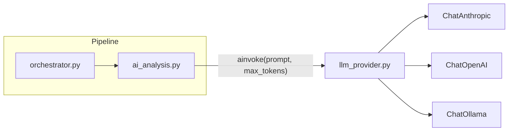

# LangChain Multi-Provider Migration

The old plan in [langchain_migration.md](NewsTrader/plans/langchain_migration.md) was written against a monolithic `AnalyzePortfolio_Pipeline.py`. The code has since been refactored into modules. This updated plan targets the current architecture:

- [config.py](NewsTrader/Scripts/config.py) -- global state, API key loading
- [ai_analysis.py](NewsTrader/Scripts/ai_analysis.py) -- the two AI call-sites (`troubleshoot_no_price`, `analyze_data`)
- [orchestrator.py](NewsTrader/Scripts/orchestrator.py) -- pipeline flow (calls into `ai_analysis`)

---

## Architecture

A new module `**llm_provider.py**` acts as the single abstraction layer. It wraps LangChain chat models and exposes one async function (`ainvoke`) that `ai_analysis.py` calls.

**Configuration lives entirely in `Scripts/env.txt`.** The existing `config.load_env_keys()` already loads every `KEY=VALUE` line from `env.txt` into `os.environ` before any initialization runs. `llm_provider.init_llm()` then reads from `os.environ`, so all settings (provider, model, API keys, Ollama URL) are controlled by editing `env.txt` -- no separate shell environment variables are needed.




---

## 1. New module: `Scripts/llm_provider.py`

Provides three public functions:

- `**init_llm()**` -- synchronous. Reads settings from `os.environ` (populated from `env.txt`), instantiates the correct LangChain chat model, stores it in a module-level `_LLM` variable. For Ollama, resolves the base URL (Docker-aware, dual-port) and validates model existence via `/api/tags`.
- `**async verify_llm()**` -- async. Sends a minimal test prompt ("Say OK", `max_tokens=5`) to the configured model and prints success/failure. Raises `RuntimeError` on failure so the pipeline can abort early. Must be called with `await` (inside an async context) or wrapped in `asyncio.run()`.
- `**async ainvoke(prompt, max_tokens=1000) -> str**` -- sends a `HumanMessage` to the active model, returns the text content.

### Ollama host resolution (inspired by `select_llm.py`)

For the `ollama` provider, the module includes Docker-aware host resolution and dual-port auto-detection:

- Detects Docker environment (`/.dockerenv` or `/run/.containerenv`) and uses `host.docker.internal` instead of `localhost`.
- If `OLLAMA_BASE_URL` is explicitly set in `env.txt`, uses that directly.
- Otherwise auto-detects by probing MAC port (12434, GPU/VRAM) first, then Windows port (11434). Prefers the one where the requested model is available.
- Verifies model existence via `GET /api/tags` before creating the `ChatOllama` instance.

### Provider resolution logic

```python
import os
import httpx
from langchain_core.messages import HumanMessage

# Settings read from os.environ (populated from env.txt by config.load_env_keys):
#   AI_PROVIDER      = anthropic | openai | ollama   (default: anthropic)
#   AI_MODEL         = model name                     (default per provider)
#   ANTHROPIC_API_KEY / OPENAI_API_KEY               (required for cloud providers)
#   OLLAMA_BASE_URL                                   (optional; auto-detected if not set)

_LLM = None
_PROVIDER = None   # store for verify/logging

OLLAMA_MAC_PORT = 12434
OLLAMA_WIN_PORT = 11434


def _ollama_host():
    """Return host -- Docker-aware."""
    in_docker = os.path.exists("/.dockerenv") or os.path.exists("/run/.containerenv")
    return "http://host.docker.internal" if in_docker else "http://localhost"


def _fetch_ollama_models(base_url, timeout=5.0):
    """Return (reachable, model_names)."""
    try:
        r = httpx.get(f"{base_url.rstrip('/')}/api/tags", timeout=timeout)
        r.raise_for_status()
        return True, [m["name"] for m in r.json().get("models", [])]
    except Exception:
        return False, []


def _resolve_ollama_url(model):
    """Resolve Ollama base URL: explicit env, then MAC (GPU), then Windows."""
    explicit = os.environ.get("OLLAMA_BASE_URL", "").strip()
    if explicit:
        reachable, names = _fetch_ollama_models(explicit)
        if not reachable:
            raise RuntimeError(f"Ollama not reachable at {explicit}")
        if model and model not in names:
            raise ValueError(f"Model '{model}' not found at {explicit}. Pull: ollama pull {model}")
        return explicit.rstrip("/")

    host = _ollama_host()
    for port, label in [(OLLAMA_MAC_PORT, "MAC/GPU"), (OLLAMA_WIN_PORT, "Windows")]:
        url = f"{host}:{port}"
        reachable, names = _fetch_ollama_models(url)
        if reachable and (not model or model in names):
            print(f"  Using Ollama on {label} (port {port}).")
            return url
    raise RuntimeError("Ollama not reachable. Set OLLAMA_BASE_URL in env.txt.")


def init_llm():
    global _LLM, _PROVIDER
    _PROVIDER = os.environ.get("AI_PROVIDER", "anthropic").lower()
    model = os.environ.get("AI_MODEL")

    if _PROVIDER == "anthropic":
        from langchain_anthropic import ChatAnthropic
        api_key = os.environ.get("ANTHROPIC_API_KEY")
        if not api_key:
            raise RuntimeError("ANTHROPIC_API_KEY not set in env.txt")
        _LLM = ChatAnthropic(anthropic_api_key=api_key, model=model or "claude-3-5-haiku-latest")

    elif _PROVIDER == "openai":
        from langchain_openai import ChatOpenAI
        api_key = os.environ.get("OPENAI_API_KEY")
        if not api_key:
            raise RuntimeError("OPENAI_API_KEY not set in env.txt")
        _LLM = ChatOpenAI(api_key=api_key, model=model or "gpt-4o-mini")

    elif _PROVIDER == "ollama":
        from langchain_ollama import ChatOllama
        effective_model = model or "llama3"
        base_url = _resolve_ollama_url(effective_model)
        _LLM = ChatOllama(model=effective_model, base_url=base_url)

    else:
        raise ValueError(f"Unknown AI_PROVIDER: {_PROVIDER}")

    print(f"  LLM initialized: provider={_PROVIDER}, model={model or '(default)'}")


async def verify_llm():
    """Send a minimal test prompt to confirm the model is reachable and responds.
    Raises RuntimeError with a clear message on failure.
    Must be awaited (or wrapped in asyncio.run() from sync code)."""
    if _LLM is None:
        raise RuntimeError("LLM not initialized -- call init_llm() first")
    try:
        bound = _LLM.bind(max_tokens=5)
        await bound.ainvoke([HumanMessage(content="Say OK")])
        print(f"  LLM verified: {_PROVIDER} responded OK.")
    except Exception as e:
        raise RuntimeError(
            f"LLM verification failed ({_PROVIDER}): {e}\n"
            "  Check your API key, model name, and network connectivity in env.txt."
        ) from e


async def ainvoke(prompt: str, max_tokens: int = 1000) -> str:
    if _LLM is None:
        raise RuntimeError("LLM not initialized -- call init_llm() first")
    bound = _LLM.bind(max_tokens=max_tokens)
    response = await bound.ainvoke([HumanMessage(content=prompt)])
    return response.content
```

Key design decisions:

- **Verification on startup:** `verify_llm()` is an async function called once during pipeline startup (from `orchestrator.main()` via `await`, or from `--model-check` via `asyncio.run()`). It sends a trivial "Say OK" prompt with `max_tokens=5` to catch bad API keys, unreachable servers, or invalid model names immediately -- before the pipeline processes any assets. Skipped when `--dummy-analysis` is active.
- **Ollama pre-flight:** For Ollama, `init_llm()` already validates reachability and model existence via `/api/tags` during URL resolution (before the LangChain object is even created). `verify_llm()` then does the actual inference test on top.
- **Docker-aware:** Ollama host resolution detects Docker and uses `host.docker.internal`. Dual-port auto-detection prefers MAC (GPU, port 12434) over Windows (port 11434), matching `select_llm.py` behavior.
- `max_tokens` is passed per-call via `.bind()` so the two call-sites (`troubleshoot_no_price` at 150, `analyze_data` at 1000) share one LLM instance.
- Lazy provider imports so only the selected provider's dependency is needed at runtime.
- No global `config.ANTHROPIC_CLIENT` anymore; the module owns its own state.

---

## 2. Update `Scripts/config.py`

- **Remove** `ANTHROPIC_CLIENT = None` global variable (line 26).
- **Remove** `import anthropic` and `ANTHROPIC_CLIENT = anthropic.AsyncAnthropic(...)` from `load_env_keys()` (lines 37-39, 73-78).
- **Remove** `ANTHROPIC_CLIENT` from the `global` statement on line 37.
- `load_env_keys()` **no longer touches the LLM** -- it only loads env files and sets API key globals. LLM initialization moves to `orchestrator.py` and the `--model-check` path (see sections 2b and 4).

The relevant section becomes:

```python
def load_env_keys():
    global TIINGO_KEY, ALPACA_KEY, ALPACA_SECRET, TR_PHONE, TR_PIN
    # ... (existing env file loading stays unchanged) ...

    if loaded_any:
        TIINGO_KEY = os.environ.get("TIINGO_API_KEY")
        ALPACA_KEY = ...
        # ... (same as before, minus the Anthropic block) ...
```

---

## 2b. Update `Scripts/orchestrator.py`

After `config.load_env_keys()` (line 146), add LLM init + async verification:

```python
import llm_provider

async def main():
    # ... (existing setup code) ...

    config.load_env_keys()

    # Initialize and verify LLM (replaces Anthropic client init)
    if not config.DUMMY_ANALYSIS:
        try:
            llm_provider.init_llm()
            await llm_provider.verify_llm()
        except Exception as e:
            print(f"FATAL: LLM not available: {e}")
            sys.exit(1)
    else:
        print("[DUMMY] Skipping LLM initialization.")

    # ... (rest of pipeline) ...
```

This works correctly because `orchestrator.main()` is already async (called via `asyncio.run(main())`), so `await llm_provider.verify_llm()` runs naturally inside the event loop.

---

## 3. Update `Scripts/ai_analysis.py`

Replace direct Anthropic SDK calls with `llm_provider.ainvoke()`.

### 3.1 `troubleshoot_no_price` (lines 49-57)

Current:

```python
if config.ANTHROPIC_CLIENT:
    response = await config.ANTHROPIC_CLIENT.messages.create(
        model="claude-3-5-haiku-latest", max_tokens=150,
        messages=[{"role": "user", "content": prompt}],
    )
    advice = response.content[0].text.strip()
```

New:

```python
import llm_provider

advice = (await llm_provider.ainvoke(prompt, max_tokens=150)).strip()
```

### 3.2 `analyze_data` (lines 197-206)

Current:

```python
if not config.ANTHROPIC_CLIENT:
    return {"error": "Anthropic Client not initialized"}
response = await config.ANTHROPIC_CLIENT.messages.create(
    model="claude-3-haiku-20240307", max_tokens=1000,
    messages=[{"role": "user", "content": prompt}],
)
response_text = response.content[0].text
```

New:

```python
import llm_provider

response_text = await llm_provider.ainvoke(prompt, max_tokens=1000)
```

The guard `if not config.ANTHROPIC_CLIENT` becomes unnecessary because `ainvoke()` raises `RuntimeError` if the LLM wasn't initialized -- caught by the existing `try/except`.

### 3.3 Module docstring and imports

- Update docstring from `"AI analysis: Anthropic Claude for..."` to `"AI analysis: LLM-powered portfolio recommendations and price troubleshooting."`
- Add `import llm_provider`.
- Remove `import config` only if no other config references remain (it is still needed for `config.DUMMY_ANALYSIS`).

---

## 4. Update `Scripts/AnalyzePortfolio_Pipeline.py` -- `--model-check` flag

Add a `--model-check` CLI option. When passed, the script loads `env.txt`, initializes the LLM, sends a short "hello" prompt to verify the model responds, prints the result, and exits immediately -- no portfolio analysis is performed.

Current entry point:

```python
if __name__ == "__main__":
    if "--dummy-analysis" in sys.argv:
        config.DUMMY_ANALYSIS = True
        print("[DUMMY] AI analysis disabled ...")

    try:
        asyncio.run(main())
    except Exception as e:
        print(f"\nUnexpected error: {e}")
```

New:

```python
import llm_provider

if __name__ == "__main__":
    if "--dummy-analysis" in sys.argv:
        config.DUMMY_ANALYSIS = True
        print("[DUMMY] AI analysis disabled ...")

    if "--model-check" in sys.argv:
        print("Model check: loading env.txt and verifying LLM...")
        config.load_env_keys()
        try:
            llm_provider.init_llm()
            asyncio.run(llm_provider.verify_llm())
            print("Model check PASSED.")
        except Exception as e:
            print(f"Model check FAILED: {e}")
            sys.exit(1)
        sys.exit(0)

    try:
        asyncio.run(main())
    except Exception as e:
        print(f"\nUnexpected error: {e}")
```

Note: `--model-check` runs outside `asyncio.run(main())`, so it uses `asyncio.run(llm_provider.verify_llm())` to create a temporary event loop for the async verification call. The `--model-check` block exits before the pipeline starts. It is independent of `--dummy-analysis` (if both are passed, `--model-check` takes priority since it runs first and exits).

---

## 5. Update `Scripts/requirements.txt`

Remove:

- `anthropic` (becomes a transitive dependency of `langchain-anthropic`)
- `claude_agent_sdk` (unused after migration)

Add:

- `langchain-core`
- `langchain-anthropic`
- `langchain-openai`
- `langchain-ollama`
- `httpx` (used by Ollama reachability checks; also a transitive dep of langchain)

---

## 6. Enhance `Scripts/env.txt`

`env.txt` becomes the single configuration file for the entire pipeline. It is loaded by `config.load_env_keys()` into `os.environ` before `llm_provider.init_llm()` runs. All AI settings live here.

The enhanced file lists every possible setting, grouped by provider. Anthropic is enabled (uncommented); OpenAI and Ollama sections are commented out. To switch providers, uncomment the desired section and set `AI_PROVIDER` accordingly.

Target contents:

```
# ============================================================
# AI Provider Configuration
# ============================================================
# AI_PROVIDER: anthropic (default) | openai | ollama
# AI_MODEL:    override the default model for the chosen provider
# ============================================================
AI_PROVIDER=anthropic

# --- Anthropic ---
ANTHROPIC_API_KEY=sk-ant-api03-...  (existing key stays)
AI_MODEL=claude-3-5-haiku-latest

# --- OpenAI (uncomment to use) ---
# AI_PROVIDER=openai
# OPENAI_API_KEY=sk-...
# AI_MODEL=gpt-4o-mini

# --- Ollama (uncomment to use) ---
# AI_PROVIDER=ollama
# AI_MODEL=llama3
# OLLAMA_BASE_URL=http://localhost:11434
# If OLLAMA_BASE_URL is not set, auto-detects: MAC/GPU (port 12434) then Windows (port 11434).
# In Docker, host.docker.internal is used automatically.
```

Key points:

- The last uncommented `AI_PROVIDER=` line wins (since `config.py` loads lines top-to-bottom into `os.environ`, later values overwrite earlier ones for the same key).
- `AI_MODEL` is optional; each provider has a sensible default in `llm_provider.py`.
- The existing `ANTHROPIC_API_KEY` line is preserved with its current value.
- To switch to OpenAI: comment out the Anthropic `AI_PROVIDER`/`AI_MODEL` lines, uncomment the OpenAI block.
- To switch to Ollama: same pattern; no API key required. If `OLLAMA_BASE_URL` is omitted, auto-detection probes MAC (GPU, port 12434) then Windows (port 11434).

---

## 7. Update the plan document

Replace the contents of [langchain_migration.md](NewsTrader/plans/langchain_migration.md) with the updated plan reflecting the modular architecture and multi-provider support.

---

## 8. Testing

- `--model-check` -- loads env.txt, inits LLM, sends "Say OK" test prompt, prints PASSED/FAILED, exits. No pipeline runs. Quick way to verify provider/key/model configuration.
- `--dummy-analysis` -- LLM is never initialized, no API key needed, pipeline completes with dummy results.
- Normal run (no flags, Anthropic default) -- `init_llm()` + `verify_llm()` must pass; pipeline aborts with a clear error if the model is unreachable or the API key is invalid.
- Set `AI_PROVIDER=openai` + valid `OPENAI_API_KEY` in env.txt -- verify the OpenAI path works (use `--model-check` first, then full run).
- Set `AI_PROVIDER=ollama` in env.txt -- verify auto-detection finds the server, checks model availability, and the pipeline runs.
- Verify JSON parsing in `analyze_data` still works (LangChain returns `response.content` as a plain string, same as `response.content[0].text` from the Anthropic SDK).

