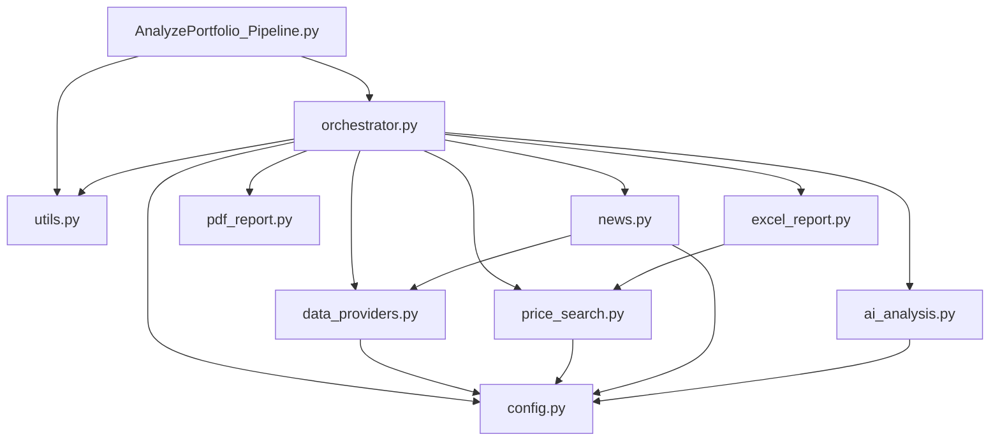

# Refactor AnalyzePortfolio_Pipeline.py

## Current State

`[AnalyzePortfolio_Pipeline.py](NewsTrader/Scripts/AnalyzePortfolio_Pipeline.py)` is a single 1526-line file containing everything: configuration, data providers, web scraping, news aggregation, AI analysis, PDF generation, Excel reporting, and orchestration. This makes it hard to navigate, test, or extend.

## Proposed Structure

All new modules live as flat files alongside the original script in `Scripts/`:

```
NewsTrader/Scripts/
  AnalyzePortfolio_Pipeline.py     <-- becomes thin entry point (backward compat)
  config.py                        <-- paths, API keys, globals
  utils.py                         <-- Tee, signal handler
  data_providers.py                <-- Tiingo, Alpaca, forex
  price_search.py                  <-- web scraping for prices
  news.py                          <-- Google News, news aggregation
  ai_analysis.py                   <-- Anthropic AI analysis
  pdf_report.py                    <-- PDF generation
  excel_report.py                  <-- Excel output & styling
  orchestrator.py                  <-- main() pipeline logic
```

## Module Breakdown

### 1. `config.py` -- Configuration and API keys (lines 19-180)

- Platform-specific path constants (`MCP_BASE`, `TIINGO_MCP_PATH`, etc.)
- Global mutable state (`Global_EURUSD`, API key variables, `ANTHROPIC_CLIENT`)
- `load_env_keys()` function
- Web price cache file path constants (lines 325-329)
- `sys.stdout.reconfigure` for Windows (line 114)

### 2. `utils.py` -- Small utilities (lines 117-127, 1512-1519)

- `Tee` class (dual stdout/file logging)
- `handle_sigint()` signal handler

### 3. `data_providers.py` -- External API wrappers (lines 38-76, 79-104, 275-322)

- Tiingo subprocess wrapper (`_run_tiingo`, `tiingo_get_price`, `tiingo_get_news`) -- platform-conditional
- Alpaca client setup and `ALPACA_AVAILABLE` flag
- `get_forex_rate()` function
- Imports path constants from `config`

### 4. `price_search.py` -- Price fetching via web scraping (lines 324-604)

- `load_web_price_cache()` / `save_web_price_cache()`
- `deep_dive_price_search()` -- tries Onvista, Ariva, Comdirect, BNP, Google, etc.
- Imports `WEB_PRICE_CACHE_FILE` from `config`

### 5. `news.py` -- News aggregation (lines 606-832)

- `get_google_news()` -- Google News RSS parsing
- `aggregate_news()` -- multi-source news collection (Google News, Tiingo, Alpaca, Boersen-Zeitung)
- Imports `tiingo_get_news` from `data_providers`, `ALPACA_AVAILABLE` from `data_providers`

### 6. `ai_analysis.py` -- AI-powered analysis (lines 655-1061)

- `troubleshoot_no_price()` -- asks Claude for price-source advice
- `analyze_data()` -- builds the portfolio-manager prompt, calls Anthropic, parses JSON response
- Imports `ANTHROPIC_CLIENT` from `config`

### 7. `pdf_report.py` -- PDF generation (lines 107-271)

- ReportLab imports
- `create_pdf()` function

### 8. `excel_report.py` -- Excel output and styling (lines 1214-1509)

- `format_dataframe_for_output()` (currently a nested function inside `main()`)
- Excel styling logic (header fills, recommendation colors, column widths)
- Price-sources sheet generation
- Extracted into a top-level function: `save_analysis_excel(output_file, results, watchlist_results, assets)`
- Imports `load_web_price_cache`, `save_web_price_cache` from `price_search`

### 9. `orchestrator.py` -- Main pipeline flow (lines 1063-1210, 1510-1526)

- `fetch_asset_data()` (lines 834-919) -- coordinates price + news fetching per asset
- `main()` async function: sets up logging, loads Excel data, iterates assets, calls fetch/analyze/report
- When `config.DUMMY_ANALYSIS` is `True`, use `Open_Positions_Debug.xlsx` and `Watch_Positions_Debug.xlsx` for input; otherwise use `Open_Positions.xlsx` and `Watch_Positions.xlsx`
- Imports from all other modules

### 10. `AnalyzePortfolio_Pipeline.py` -- Thin entry point (replaces current 1526-line file)

```python
"""Backward-compatible entry point. All logic lives in the sibling modules."""
import sys
import asyncio
import signal
import config
from utils import handle_sigint
from orchestrator import main

signal.signal(signal.SIGINT, handle_sigint)

if __name__ == "__main__":
    if "--dummy-analysis" in sys.argv:
        config.DUMMY_ANALYSIS = True
        print("[DUMMY] AI analysis disabled -- generating placeholder results.")

    try:
        asyncio.run(main())
    except Exception as e:
        print(f"\nUnexpected error: {e}")
```

## Translation: German to English

All German text throughout the codebase will be translated to English during the refactor. This includes:

- **Print/log messages**: e.g. `"Unerwarteter Fehler"` -> `"Unexpected error"`, `"Programmabbruch durch Benutzer"` -> `"Aborted by user"`
- **Comments**: All inline and block comments
- **Variable names**: e.g. `Einkaufspreis` -> `purchase_price`, `Anzahl` -> `quantity`, `Stueckzahl` -> `quantity`, `Empfohlene_Stueckzahl` -> `recommended_quantity`
- **AI prompt**: The full portfolio-manager prompt (lines 974-1023) rewritten in English, including the `ROLE`, `TASK`, `FORMAT`, and `OUTPUT` JSON keys (`Empfehlung` -> `Recommendation`, `Begründung` -> `Reasoning`, `Grund_fuer_Menge` -> `quantity_reasoning`, `Genauigkeit` -> `Confidence`, `Zielpreis` -> `target_price`, `Stop_Loss` -> `stop_loss`)
- **Excel column headers**: `Empfehlung` -> `Recommendation`, `Begründung` -> `Reasoning`, `Begründung Änderung` -> `Change Reasoning`, `Nachrichten-Sentiment` -> `News Sentiment`, `Gesamtanzahl` -> `Total Quantity`, `Invest €` -> `Invested EUR`, `Profit €` -> `Profit EUR`, `Profit %` -> `Profit %`
- **PDF labels**: `Analyse` -> `Analysis`, `Datum` -> `Date`, `Daten` -> `Data`, `KI-Analyse & News-Zusammenfassung` -> `AI Analysis & News Summary`
- **Recommendation values**: `Kaufen` -> `Buy`, `Verkaufen` -> `Sell`, `Halten` -> `Hold`, `Aufstocken` -> `Add`, `Reduzieren` -> `Reduce`
- **Conditional formatting checks**: Updated to match new English recommendation strings

Note: The input Excel files (`Open_Positions.xlsx`, `Watch_Positions.xlsx`) may still have German column names like `Einkaufspreis`, `Anzahl`, `Stueckzahl`. The code will continue to read these via `.get()` lookups, mapping them to English internal names during processing.

## `--dummy-analysis` Flag

When the script is invoked with `--dummy-analysis`, the Anthropic AI calls are skipped entirely and debug input files are used. This saves time and money during development/debugging.

**How it works:**

- `config.py` defines a global: `DUMMY_ANALYSIS = False`
- The entry point (`AnalyzePortfolio_Pipeline.py`) parses `sys.argv` for `--dummy-analysis` and sets `config.DUMMY_ANALYSIS = True`
- **Input files**: When `DUMMY_ANALYSIS` is `True`, the orchestrator uses `Open_Positions_Debug.xlsx` and `Watch_Positions_Debug.xlsx` instead of `Open_Positions.xlsx` and `Watch_Positions.xlsx`. If the debug files do not exist, fall back to the production files (or fail with a clear message, depending on preference).
- `ai_analysis.py` checks `config.DUMMY_ANALYSIS` at the top of both `analyze_data()` and `troubleshoot_no_price()`:
  - If `True`, returns a deterministic dummy result immediately without calling the API
  - Prints a clear log line: `"  [DUMMY] Skipping AI analysis for {asset_name}"`

**Dummy result structure** (matches the real AI response schema):

```python
{
    "Recommendation": "Hold",
    "recommended_quantity": 0,
    "Reasoning": "[DUMMY] AI analysis skipped (--dummy-analysis mode). No real recommendation.",
    "quantity_reasoning": "[DUMMY] No quantity calculation performed.",
    "Confidence": "Low",
    "target_price": None,
    "stop_loss": None,
}
```

This ensures all downstream code (PDF generation, Excel output, formatting) works identically -- it just processes placeholder text instead of real AI output.

## Cursor Agent Rule

Create `.cursor/rules/newstrader-testing.mdc` (at the repo root `/home/dev/proj/ai-financials/.cursor/rules/`) with a glob pattern scoped to the pipeline scripts. This rule instructs the AI agent to always use `--dummy-analysis` when running or testing the pipeline:

```markdown
---
description: When testing or running the NewsTrader pipeline, always use --dummy-analysis to skip real AI API calls
globs: NewsTrader/Scripts/*.py
alwaysApply: false
---

# NewsTrader Pipeline Testing

When running or testing `AnalyzePortfolio_Pipeline.py` (or any script that invokes the pipeline), always pass the `--dummy-analysis` flag:

python AnalyzePortfolio_Pipeline.py --dummy-analysis

This skips real Anthropic API calls and generates deterministic dummy results instead. This saves time, money, and avoids rate limits during development and debugging.

Never run the pipeline without `--dummy-analysis` unless the user explicitly asks for a real/live analysis run.
```

## Key Design Decisions

- **Flat layout in Scripts/**: No sub-package needed. All modules are plain sibling `.py` files. Since the script is always run from `Scripts/` (or with `Scripts/` as cwd), bare imports like `from config import ...` work correctly.
- **Shared state**: `Global_EURUSD` and API keys live in `config.py` as module-level variables. Functions that mutate them (like `load_env_keys`) update `config.Global_EURUSD` etc. via `import config; config.Global_EURUSD = value`. This preserves current behavior without introducing a class.
- **Circular imports avoided**: The dependency graph flows one way: `orchestrator` -> `data_providers`, `price_search`, `news`, `ai_analysis`, `pdf_report`, `excel_report` -> `config`, `utils`. No module imports from `orchestrator`.
- **Backward compatibility**: `AnalyzePortfolio_Pipeline.py` keeps its name and stays as the entry point, so `Run_Analysis.bat` and `launch.json` continue to work unchanged.
- **No behavioral changes**: This is a pure structural refactor. All logic, prompts, and output remain identical.

## Dependency Flow




