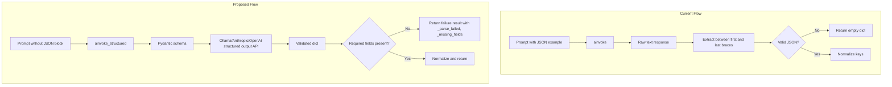

# Reliable AI Analysis Output Plan

## Problem Summary

The current [ai_analysis.py](NewsTrader/Scripts/ai_analysis.py) relies on prompt instructions and brittle `{`/`}` extraction to parse JSON. Small models (tinyllama, mistral) often fail to produce valid JSON, and failures are silently reported as empty `{}` with only a console message. Downstream (Excel, PDF) shows blank cells without indicating the analysis failed.

## Architecture




## 1. JSON Remains the Best Choice

JSON is the correct format because:

- All three providers (Ollama, Anthropic, OpenAI) support **structured output** via JSON schema at the API level
- Ollama's structured output (Dec 2024) constrains generation so even small models produce valid JSON
- No alternative format (YAML, XML, custom) offers better cross-provider support or reliability

## 2. Define Analysis Schema and Required Fields

Create a Pydantic model in [ai_analysis.py](NewsTrader/Scripts/ai_analysis.py) (or a shared module):

```python
from pydantic import BaseModel, Field
from typing import Literal

class AnalysisResult(BaseModel):
    Recommendation: Literal["Buy", "Sell", "Hold", "Add", "Reduce"]
    recommended_quantity: int
    Reasoning: str
    quantity_reasoning: str
    Confidence: Literal["High", "Medium", "Low"]
    target_price: float | None = None
    stop_loss: float | None = None
```

**Required for downstream:** `Recommendation`, `Reasoning`, `quantity_reasoning`, `recommended_quantity`, `Confidence`  
**Optional:** `target_price`, `stop_loss`

## 3. Extend llm_provider with Structured Invoke

Add to [llm_provider.py](NewsTrader/Scripts/llm_provider.py):

- `ainvoke_structured(prompt: str, schema: type[BaseModel], max_tokens: int = 1000) -> dict | None`
- Uses `_LLM.with_structured_output(schema)` (all three LangChain providers support this)
- Returns parsed dict on success, or `None` on failure (caller handles reporting)
- Provider-specific: Ollama uses `method="json_schema"`; Anthropic/OpenAI use their native `with_structured_output`

## 4. Refactor ai_analysis.analyze_data()

**Primary path:** Call `llm_provider.ainvoke_structured(prompt, AnalysisResult)`.

**Fallback path:** If structured output raises (e.g. Ollama schema violation), fall back to current prompt-based parsing with **stricter validation**:

- Extract JSON (existing `{`/`}` logic + control-char cleanup)
- Validate against schema: check required keys exist, types are correct
- If validation fails: build and return a **structured failure result**

**Structured failure result** (never return empty `{}`):

```python
{
    "Recommendation": "[Parse failed]",
    "recommended_quantity": 0,
    "Reasoning": "[Incomplete] Model response could not be parsed.",
    "quantity_reasoning": f"[Missing] Required fields: {', '.join(missing)}",
    "Confidence": "Low",
    "target_price": None,
    "stop_loss": None,
    "_parse_failed": True,
    "_missing_fields": ["Recommendation", "Reasoning"],
    "_raw_preview": "..."  # First 200 chars of response for debugging
}
```

## 5. Explicit Failure Detection and Reporting

- **Validation function** `_validate_analysis_result(data: dict) -> tuple[bool, list[str]]`  
Returns `(is_valid, missing_fields)`.
- **Console output:** On failure, print:
  ```
  Analysis incomplete for {asset_name}: missing or invalid fields [Recommendation, Reasoning].
  Raw response preview: "..."
  ```
- **Excel/PDF:** When `_parse_failed` is True or `Recommendation == "[Parse failed]"`, format_dataframe_for_output and create_pdf already handle it: the Recommendation cell will show `[Parse failed]` so the user sees it clearly.

## 6. Simplify the Prompt

Remove the explicit JSON block from the prompt when using structured output. The schema is enforced by the API; the prompt should focus on the analysis task. Keep the FORMAT section for the news list (that goes into `Reasoning`), but drop `OUTPUT (JSON): {...}` since the schema drives the structure.

## 7. Excel Report Handling

[excel_report.py](NewsTrader/Scripts/excel_report.py) already uses `df["Recommendation"].values` and falls back to `[""] * n_rows` if missing. Ensure failed results have `Recommendation: "[Parse failed]"` so the Excel shows that string instead of blank. No structural changes needed if we always return a non-empty dict with that key.

## 8. Lenient Parsing for Partial Success (Required)

When we get valid JSON but some required fields are missing or have wrong types, implement lenient handling:

- **Fill missing required fields** with `"[Missing]"` (for absent keys) or `"[Invalid]"` (for wrong type, e.g. string where int expected)
- **Set** `_parse_failed: True` and `_missing_fields` with the list of problematic fields
- **Surface partial data** – keep any valid fields (e.g. Reasoning, target_price) so the user gets useful information
- **Never discard** valid content from the model; only substitute placeholders for missing/invalid required fields

Example: If JSON has `{"Reasoning": "Good analysis...", "Confidence": "High"}` but lacks Recommendation and recommended_quantity:

```python
{
    "Recommendation": "[Missing]",
    "recommended_quantity": 0,
    "Reasoning": "Good analysis...",
    "quantity_reasoning": "[Missing]",
    "Confidence": "High",
    "target_price": None,
    "stop_loss": None,
    "_parse_failed": True,
    "_missing_fields": ["Recommendation", "recommended_quantity", "quantity_reasoning"]
}
```

## 9. Simplify env.txt – Single Provider Selection

Restructure [env.txt](NewsTrader/Scripts/env.txt) so the user only edits `AI_PROVIDER` at the top. All provider settings remain enabled; no commenting/uncommenting.

**New structure:**

```
# ============================================================
# AI Provider: change only this line to switch providers
# ============================================================
AI_PROVIDER=ollama

# --- Anthropic (used when AI_PROVIDER=anthropic) ---
ANTHROPIC_API_KEY=sk-ant-...
ANTHROPIC_MODEL=claude-3-5-haiku-latest

# --- OpenAI (used when AI_PROVIDER=openai) ---
OPENAI_API_KEY=sk-proj-...
OPENAI_MODEL=gpt-4o-mini

# --- Ollama (used when AI_PROVIDER=ollama) ---
OLLAMA_MODEL=mistral:latest
OLLAMA_BASE_URL=http://host.docker.internal:12434
```

**Changes:**

- Replace single `AI_MODEL` with provider-specific keys: `ANTHROPIC_MODEL`, `OPENAI_MODEL`, `OLLAMA_MODEL`
- All three sections stay active; no `# AI_PROVIDER=...` toggles
- [llm_provider.py](NewsTrader/Scripts/llm_provider.py) reads `AI_PROVIDER` and uses the corresponding `*_MODEL` and API key

**llm_provider logic:**

```python
if _PROVIDER == "anthropic":
    model = os.environ.get("ANTHROPIC_MODEL") or "claude-3-5-haiku-latest"
elif _PROVIDER == "openai":
    model = os.environ.get("OPENAI_MODEL") or "gpt-4o-mini"
elif _PROVIDER == "ollama":
    model = os.environ.get("OLLAMA_MODEL") or "llama3"
```

## File Changes Summary


| File                                                  | Changes                                                                                                                                                                                                                                                                                         |
| ----------------------------------------------------- | ----------------------------------------------------------------------------------------------------------------------------------------------------------------------------------------------------------------------------------------------------------------------------------------------- |
| [env.txt](NewsTrader/Scripts/env.txt)                 | Restructure: AI_PROVIDER at top only; use ANTHROPIC_MODEL, OPENAI_MODEL, OLLAMA_MODEL; all provider sections always present                                                                                                                                                                     |
| [llm_provider.py](NewsTrader/Scripts/llm_provider.py) | Add `ainvoke_structured`; read provider-specific `*_MODEL` env vars instead of `AI_MODEL`                                                                                                                                                                                                       |
| [ai_analysis.py](NewsTrader/Scripts/ai_analysis.py)   | Add `AnalysisResult` Pydantic model; refactor `analyze_data` to use structured invoke with fallback; add `_validate_analysis_result`; implement lenient parsing for partial success (fill missing/invalid with placeholders, keep valid fields); return structured failure dict instead of `{}` |
| [excel_report.py](NewsTrader/Scripts/excel_report.py) | Minor: ensure `[Parse failed]` is displayed (likely no change if we set Recommendation explicitly)                                                                                                                                                                                              |
| [pdf_report.py](NewsTrader/Scripts/pdf_report.py)     | No change; already uses `item.get("Recommendation")`                                                                                                                                                                                                                                            |


## Testing

- Run `--quick-analysis` with Ollama mistral, tinyllama, and qwen2.5-coder to verify structured output works across model sizes
- Run with Anthropic and OpenAI to verify cloud providers
- Intentionally break a response (e.g. mock) to confirm failure result is surfaced in Excel and console

