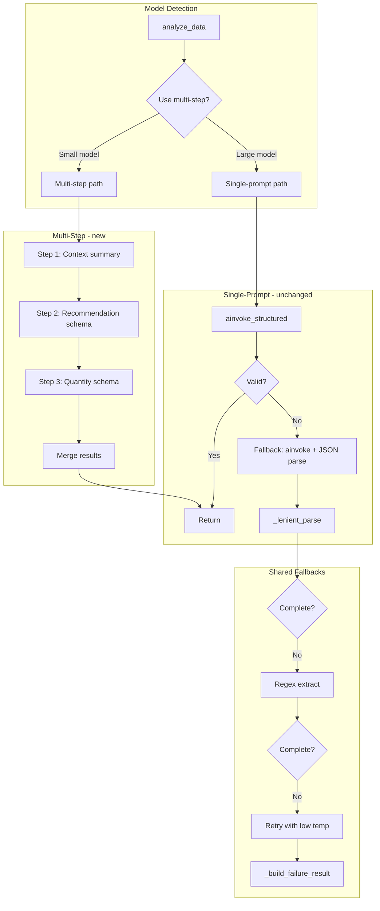

# Small Model Multi-Step Analysis Plan

## Problem

Small Ollama models (tinyllama, llama3.2:1b) fail to produce parsable JSON because:

- Context window (~~2048 tokens) is tight for the full prompt (~~1300+ tokens)
- Single complex output schema overwhelms the model
- Output is truncated or non-JSON

## Strategy: Dual-Path Architecture




**Critical constraint:** Large models (Anthropic, OpenAI, or Ollama models above the context threshold) always use the existing single-prompt path. No changes to their flow.

---

## 1. Model Detection (API-based)

Detection uses **Ollama's `POST /api/show` endpoint** to query the actual context window size (`num_ctx`) instead of guessing from the model name. This correctly handles custom quantizations, fine-tuned models, or models with manually adjusted context windows.

### New function in [llm_provider.py](NewsTrader/Scripts/llm_provider.py)

```python
def _fetch_ollama_context_size(base_url: str, model: str) -> int | None:
    """Query Ollama /api/show for the model's num_ctx. Returns None on failure."""
    try:
        r = httpx.post(f"{base_url.rstrip('/')}/api/show",
                       json={"model": model}, timeout=5.0)
        r.raise_for_status()
        data = r.json()
        # num_ctx appears in the "parameters" string, e.g. "num_ctx 2048"
        params = data.get("parameters", "")
        match = re.search(r"num_ctx\s+(\d+)", params)
        if match:
            return int(match.group(1))
        # Also check model_info for context_length keys
        model_info = data.get("model_info", {})
        for key, val in model_info.items():
            if "context_length" in key and isinstance(val, int):
                return val
        return None
    except Exception:
        return None
```

Also add `get_model_context_size() -> int | None` as a public API that caches the result (called once during `init_llm`).

### Decision function in [ai_analysis.py](NewsTrader/Scripts/ai_analysis.py)

```python
def _use_multi_step() -> bool:
    mode = os.environ.get("AI_MULTI_STEP", "auto").lower()
    if mode == "off":
        return False
    if mode == "on":
        return True
    # auto: query Ollama context size; Anthropic/OpenAI always single-step
    if os.environ.get("AI_PROVIDER", "").lower() != "ollama":
        return False
    ctx_size = llm_provider.get_model_context_size()
    if ctx_size is None:
        return False  # can't determine -> assume large
    threshold = int(os.environ.get("AI_MULTI_STEP_THRESHOLD", "4096"))
    return ctx_size <= threshold
```

### Configuration in [env.txt](NewsTrader/Scripts/env.txt)

```
# --- Multi-step analysis (splits prompt for small models) ---
# Values: auto | on | off  (default: auto)
# auto = queries Ollama for context size; uses multi-step if <= threshold
# on   = always use multi-step (any provider)
# off  = always use single-step
AI_MULTI_STEP=auto
# Context-size threshold for auto mode (tokens). Models with num_ctx <= this use multi-step.
# AI_MULTI_STEP_THRESHOLD=4096
```

### Behavior summary


| `AI_MULTI_STEP` | Provider         | Context size | Result                     |
| --------------- | ---------------- | ------------ | -------------------------- |
| `off`           | any              | any          | Single-step                |
| `on`            | any              | any          | Multi-step                 |
| `auto`          | Anthropic/OpenAI | N/A          | Single-step                |
| `auto`          | Ollama           | <= threshold | Multi-step                 |
| `auto`          | Ollama           | > threshold  | Single-step                |
| `auto`          | Ollama           | unknown      | Single-step (safe default) |


---

## 2. Multi-Step Prompt Design

**Content preservation:** All current prompt sections are included. Step 1 receives the full context; steps 2 and 3 receive condensed summaries plus the data they need.

### Step 1: Context Summary (input-heavy, output-light)

- **Input:** ROLE, DATE, ASSET, POSITIONS_DATA, MARKET_DATA (full), News list (full), PORTFOLIO_CONTEXT
- **Output:** Free-form summary (no schema). Ask: "Summarize in 3-5 sentences: key news headlines, current price, sentiment, and portfolio allocation."
- **Token budget:** Input ~1000–1200 tokens; output max 150 tokens (`num_predict=150`)

### Step 2: Recommendation (summary + portfolio)

- **Input:** Step 1 summary, PORTFOLIO_CONTEXT (total invest, current allocation, target 5%), TASK rules
- **Output:** Structured schema: `Recommendation`, `Reasoning`, `Confidence`, `target_price`, `stop_loss`
- **Token budget:** Input ~400 tokens; output max 300 tokens

### Step 3: Quantity Calculation

- **Input:** Step 2 output, current price, target position size, formula
- **Output:** Structured schema: `recommended_quantity`, `quantity_reasoning`
- **Token budget:** Input ~200 tokens; output max 150 tokens

### Sub-schemas (Pydantic)

- `Step2Result`: Recommendation, Reasoning, Confidence, target_price, stop_loss
- `Step3Result`: recommended_quantity, quantity_reasoning

Merge Step2 + Step3 into the full `AnalysisResult` shape expected by the rest of the pipeline.

---

## 3. Implementation in ai_analysis.py

### New functions

- `_build_step1_prompt(...)` – full context, asks for summary
- `_build_step2_prompt(summary, ...)` – summary + portfolio, asks for recommendation
- `_build_step3_prompt(step2_result, current_price, ...)` – asks for quantity
- `_run_multi_step_analysis(...)` – orchestrates steps 1–3, merges, returns dict

### Flow in `analyze_data`

```python
if _use_multi_step():
    result = await _run_multi_step_analysis(...)
    if result is not None:
        is_valid, missing = _validate_analysis_result(result)
        if is_valid:
            return result
        return _lenient_parse(result)
# else: existing single-prompt path (unchanged)
```

### Error handling in multi-step

- If Step 1 fails (empty/invalid): fall back to single-prompt for this asset
- If Step 2 or 3 fails: use `_lenient_parse` on partial result; fill missing fields with `[Missing]`

---

## 4. Regex/Keyword Fallback

Add `_regex_extract(raw_text: str) -> dict | None` in [ai_analysis.py](NewsTrader/Scripts/ai_analysis.py):

- `Recommendation`: `re.search(r'\b(Buy|Sell|Hold|Add|Reduce)\b', text, re.I)`
- `Confidence`: `re.search(r'\b(High|Medium|Low)\b', text, re.I)`
- `recommended_quantity`: `re.search(r'(?:recommended_quantity|quantity|shares?)\s*[=:]\s*(-?\d+)', text, re.I)` or `re.search(r'(?:buy|sell)\s+(\d+)', text, re.I)`
- `Reasoning` / `quantity_reasoning`: extract sentence containing "because" or "reason" if possible; otherwise leave empty

**Integration:** After JSON parse fails and before `_build_failure_result`, call `_regex_extract(response_text)`. If it returns a non-empty dict, pass it to `_lenient_parse` and return that (with `_parse_failed` if fields are missing).

---

## 5. Retry Logic (Last Resort)

**When:** Only if both (a) structured output and (b) fallback JSON parse (and regex) fail.

**How:**

- Add `ainvoke_retry(prompt, max_tokens=400, temperature=0.3)` in [llm_provider.py](NewsTrader/Scripts/llm_provider.py)
- For Ollama: `options={"num_predict": 400, "temperature": 0.3}`
- For Anthropic/OpenAI: `max_tokens=400`, `temperature=0.3` via `model_kwargs` or equivalent
- One retry only; then proceed to `_build_failure_result`

**Order of fallbacks:**

1. Primary: `ainvoke_structured` (or multi-step)
2. Fallback: `ainvoke` + JSON extract + `_lenient_parse`
3. Regex extract + `_lenient_parse`
4. Retry with low temp/small output
5. `_build_failure_result`

---

## 6. llm_provider.py Changes

- Add `_fetch_ollama_context_size(base_url, model)` -- queries `POST /api/show` for `num_ctx`
- Store context size in module-level `_CONTEXT_SIZE` during `init_llm()`, expose via `get_model_context_size()`
- Log discovered context size: `print(f"  Model context size: {ctx} tokens")`
- Extend `ainvoke(prompt, max_tokens=1000, temperature=None)` -- pass `temperature` when provided (for retry)
- Add `ainvoke_retry(prompt, max_tokens=400)` -- calls `ainvoke` with `temperature=0.3`
- For Ollama: extend `_bind_kwargs` to accept optional `temperature` and add it to `options`

---

## 7. Schema Simplification

**Conclusion:** No schema simplification. All fields (Recommendation, recommended_quantity, Reasoning, quantity_reasoning, Confidence, target_price, stop_loss) stay. Multi-step only splits *when* each part is requested, not *what* is requested.

---

## 8. Large Model Guarantee

- `_use_multi_step()` returns `False` for Anthropic and OpenAI (in `auto` mode)
- For Ollama in `auto` mode: returns `False` unless `num_ctx <= AI_MULTI_STEP_THRESHOLD` (default 4096)
- Single-prompt path is left completely unchanged; no new branches for large models
- Regression risk: none for large models
- User can force `AI_MULTI_STEP=on` to test multi-step with any model

---

## 9. Files to Modify


| File                                                  | Changes                                                                                                                                   |
| ----------------------------------------------------- | ----------------------------------------------------------------------------------------------------------------------------------------- |
| [ai_analysis.py](NewsTrader/Scripts/ai_analysis.py)   | `_use_multi_step`, `_build_step1/2/3_prompt`, `_run_multi_step_analysis`, `_regex_extract`, integrate into `analyze_data`, add retry call |
| [llm_provider.py](NewsTrader/Scripts/llm_provider.py) | `_fetch_ollama_context_size`, `get_model_context_size`, `_CONTEXT_SIZE` cache, `temperature` in `_bind_kwargs`, `ainvoke_retry`           |
| [env.txt](NewsTrader/Scripts/env.txt)                 | Add `AI_MULTI_STEP=auto` and commented `AI_MULTI_STEP_THRESHOLD=4096`                                                                     |


---

## 10. Testing Strategy

- **Large model (OpenAI/Anthropic):** Run `--quick-analysis`; confirm behavior unchanged
- **Small model (tinyllama):** Run `--quick-analysis`; confirm more assets parse successfully
- **Regression:** Compare Excel/PDF output for a fixed asset with large vs small model; large model output must match current behavior

